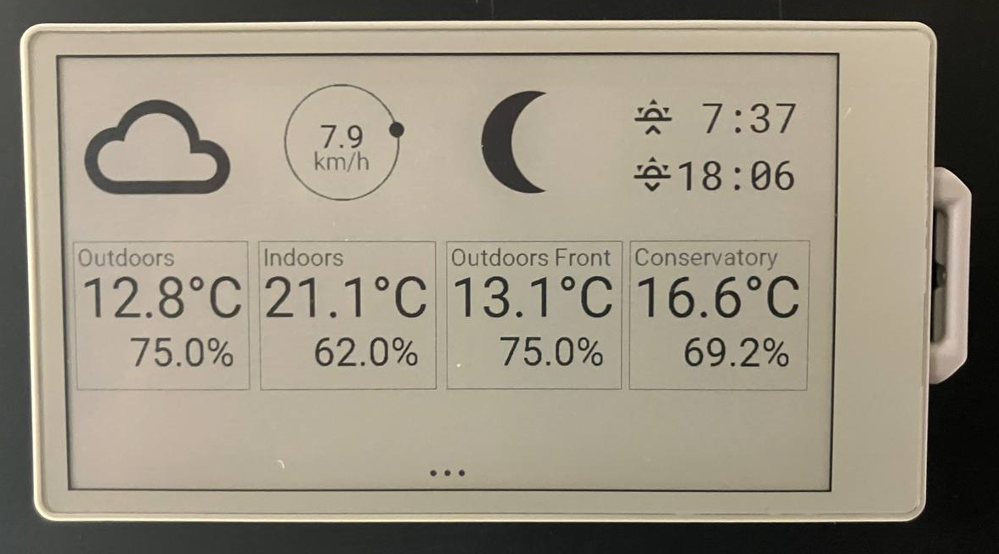

# M5PaperS3weather

A simple ESPHome HomeAssistant e-ink display for the M5 Paper S3

Thanks to [@patrick3399](https://github.com/patrick3399/esphome_components) getting the M5 Paper S3 to work in ESPHome, I knocked up a quick weather station view on home assistant data.

Sunrise/sunset, weather forecast symbol, temperature/humidity from sensors, wind speed and direction, and the moon phase.

Very rough, but...

Install ESPHome, Install Home Assistant, have a secrets.yaml with the wifi ssid/password edit the various ID's in the yaml to match your HA install, "run" the yaml

sudo  esphome run ./weather.yaml --device /dev/cu.usbmodem2101

See the same as mine.

Problems:

Unfortunately the touch screen and the real time column are erroring now because of i2c changes in [Expressif](https://forum.arduino.cc/t/conflict-driver-ng-i2c-driver/1399382) so they're commented out to be solved later.